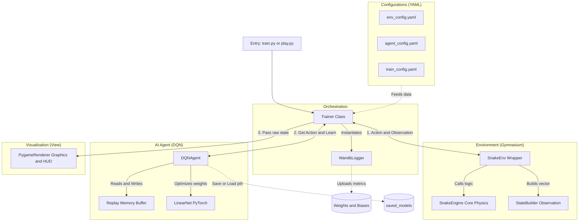
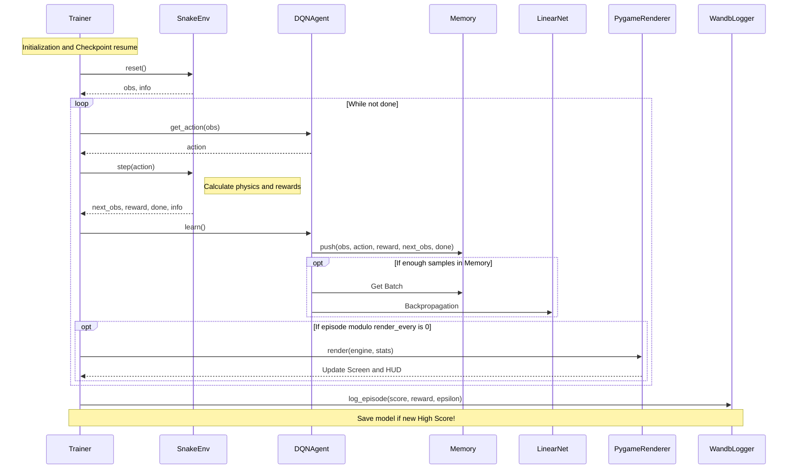

# 🐍 Reinforced Snake: Deep Q-Network Pipeline

## 📖 1. Overview

Reinforced Snake is an end-to-end Reinforcement Learning (RL) project that trains an artificial intelligence agent to master the classic game of Snake. Built entirely from scratch, this repository goes beyond a simple script by implementing a professional, production-ready Machine Learning Operations (MLOps) pipeline.

At its core, the agent leverages a **Deep Q-Network (DQN)** built with PyTorch. The project is designed with a strict **MVC (Model-View-Controller) architecture**, fully decoupling the pure mathematical game physics from the visual rendering. Featuring a Gymnasium-compliant environment wrapper, real-time metric tracking via Weights & Biases (W&B), and an intelligent checkpointing system, this project serves as both a functional RL environment and a comprehensive portfolio piece demonstrating software engineering best practices in AI.

---

## 🚀 2. Quick Start

Get the project up and running on your local machine in minutes.

### Prerequisites
Ensure you have Python 3.8+ installed. Clone this repository and navigate into the root project directory.

### Installation
Install the required top-level dependencies using `pip`:

```bash
pip install -r requirements.txt
```
(Optional) Log in to Weights & Biases to track training metrics, epsilon decay, and scores dynamically in the cloud:
``` bash
wandb login
```
### Watch the AI Play (Inference Mode)
Want to see the trained agent in action without training it from scratch? Run the play script. This loads the best pre-trained .pth model from the saved_models/ directory and forces pure exploitation of knowledge (Epsilon = 0.0).
``` bash
python play.py
```
### Train from Scratch
To start a new training session, ensure <code>resume_training: false</code> is set inside <code>configs/train_config.yaml</code>, then run the training orchestrator:
``` bash
python train.py
```
---
## 🎮 3. The Game: Rules & Custom Mechanics

While this is fundamentally the classic game of Snake, the core physics engine (`SnakeEngine`) has been carefully customized to serve as a robust Reinforcement Learning testbed.

### Core Mechanics
* **Standard Navigation & Collision Logic:** The snake navigates a discrete 2D grid. Colliding with the perimeter walls or its own body segments results in immediate death (terminal state) and a severe penalty.
* **Relative Control System:** Unlike classic games where the player uses absolute directions (Up, Down, Left, Right), this agent uses **Relative Steering** (Straight, Left, Right). This design choice makes it mathematically impossible for the snake to perform an illegal 180-degree turn into its own neck, allowing the AI to focus on high-level spatial navigation.
* **Red Apples:** Eating a standard red apple increases the snake's length by 1 and grants a standard positive reward.
* **Green Apples (High-Value Targets):** A custom addition to the classic formula. Green apples grant a significantly higher reward compared to standard ones, teaching the agent to prioritize objectives and evaluate risk-vs-reward scenarios.

### RL-Specific Engineering Modifications
* **Abstract Grid Sizing:** The mathematical map dimensions (e.g., 20x20 cells) are completely decoupled from the Pygame pixel rendering. The map size is dynamically controlled via `configs/env_config.yaml`, enabling easy difficulty scaling and the ability to train on various arena sizes without modifying the code.
* **Life Penalty (Anti-Looping):** A common pitfall in RL is the agent learning to "stall"—running in safe circles to avoid death while ignoring food. To prevent this local minimum, a **Life Penalty** (a small negative reward) is applied at every single step. This constant mathematical "drain" forces the AI to seek the most efficient path to the food to maximize its total score.

---

## ⚙️ 4. Configuration (YAML)

To maintain clean code and eliminate hardcoded magic numbers, all hyperparameters, game mechanics, and training settings are fully decoupled from the Python logic. They are managed through intuitive YAML files located in the `configs/` directory.

* **`env_config.yaml` (The Physics & Rules):** 
  Defines the mathematical world. It controls the grid dimensions (`map_width`, `map_height`) and the entire reward shaping system (values for eating red/green apples, the death penalty, and the life penalty).
  
* **`agent_config.yaml` (The AI Brain):** 
  Houses the hyperparameters for the Deep Q-Network. You can easily tweak the learning rate, discount factor (Gamma), replay memory size, batch size, and the critical exploration vs. exploitation mechanics (Epsilon start, minimum, and decay rate).

* **`train_config.yaml` (The Orchestrator):** 
  Manages the training pipeline. It sets the total number of episodes, defines how often the Pygame visualizer should render (`render_every`), configures Weights & Biases logging, and controls the checkpointing system (toggling `resume_training` and providing the `.pth` model path).

---

## 🏗️ 5. System Architecture

The project is built on a highly modular, MVC-inspired (Model-View-Controller) architecture. By strictly decoupling the game physics, the AI logic, and the visual rendering, the system is scalable, easy to debug, and capable of running in headless mode (without UI) for high-speed training on remote servers.

*   **Model (Environment):** The `SnakeEngine` handles pure mathematics and grid physics. It is wrapped by `SnakeEnv`, which acts as a bridge adhering to the standard `Gymnasium` API (providing `reset` and `step` methods).
*   **Controller (Trainer & Agent):** The `Trainer` orchestrates the training loop, passing observations from the environment to the `DQNAgent`. The agent utilizes a PyTorch neural network (`LinearNet`) and a Replay Buffer to learn optimal policies.
*   **View (Visualization):** The `PygameRenderer` is entirely separate. It receives raw game states only when required (e.g., every 50 episodes) to draw the grid, objects, and an overlaying HUD with live metrics.

Below is the C4-style block diagram illustrating the data flow and module responsibilities:


---
## 🔬 6. Deep Dive: Environment & Reward Shaping

To train a neural network, the visual game state must be translated into mathematical tensors. The AI does not "see" pixels; instead, it receives a carefully engineered **17-dimensional state vector** at every frame, and learns through a precise **Reward Shaping** system.

### The Observation Space (State Vector)
The `StateBuilder` module calculates a boolean/float array of size 17, providing the agent with spatial awareness relative to its own head:
*   **Danger Detection `[3]`**: Binary flags checking for immediate obstacles (wall or tail) in three relative directions: `[Straight, Right, Left]`.
*   **Current Direction `[4]`**: One-hot encoded vector representing the snake's current heading: `[Up, Down, Left, Right]`.
*   **Red Apple Location `[4]`**: Binary flags indicating where the standard red apple is relative to the snake's head: `[Is_Above, Is_Below, Is_Left, Is_Right]`.
*   **Green Apple Location `[4]`**: Binary flags indicating the relative direction of the high-value green apple.
*   **Target Distances / Extra Metrics `[2]`**: Additional normalized values (e.g., Manhattan distance to the food) to help the neural network calculate gradients more effectively.

### Reward Shaping System
The agent's sole objective is to maximize its cumulative reward. The reward system was designed to balance immediate gains with long-term survival, explicitly discouraging infinite loops.

| Event / Action | Reward Value (default) | Description & Intent |
| :--- | :---: | :--- |
| **Eat Green Apple** | `+20.0` | High-value target. Strongly reinforces pathfinding towards priority objectives. |
| **Eat Red Apple** | `+10.0` | Standard positive reinforcement for growing the snake's length. |
| **Life Penalty** | `-0.1` | Applied on *every single step*. Forces the agent to find the shortest path to food and prevents infinite looping (running in safe circles). |
| **Collision (Death)** | `-100.0` | Critical penalty for hitting a wall, the snake's own tail, or executing a self-destruct (180-degree turn). |

---
## 🧠 7. Deep Dive: The AI Agent & Mathematics

The "brain" of the snake is a **Deep Q-Network (DQN)**, a Reinforcement Learning algorithm that combines Q-Learning with deep neural networks. Instead of a traditional Q-table, which would be impossible to maintain for high-dimensional states, we use a neural network as a non-linear function approximator.

### The Mathematical Goal
The agent learns to approximate the optimal Q-value function, representing the maximum expected future reward for taking action $a$ in state $s$. This is governed by the **Bellman Equation**:

$$Q(s, a) = r + \gamma \max_{a'} Q(s', a')$$

Where:
*   $r$ is the immediate reward.
*   $\gamma$ (Gamma) is the discount factor (e.g., `0.9`), determining how much the agent values future rewards vs. immediate ones.
*   $\max_{a'} Q(s', a')$ is the estimate of the optimal future value.

### Action Space: Relative Navigation
To simplify the learning process and ensure spatial consistency, the agent operates on a **relative action space** instead of absolute directions (N, S, E, W):
1.  **[1, 0, 0] - Go Straight**: Maintains the current velocity vector.
2.  **[0, 1, 0] - Turn Right**: Rotates the velocity vector 90° clockwise.
3.  **[0, 0, 1] - Turn Left**: Rotates the velocity vector 90° counter-clockwise.

**Engineering Note:** This 3-action design acts as a built-in safety constraint. Since the agent cannot choose a "Reverse" action, it is mechanically impossible for the snake to perform a 180-degree turn into its own neck in a single frame. This forces the network to focus on high-level navigation and long-term tail avoidance rather than learning basic movement validity.

### Exploration vs. Exploitation (Epsilon Decay)
To solve the "Explorer's Dilemma," we use an **$\epsilon$-greedy strategy**. 
*   **Exploration:** Initially, the agent takes random actions to discover the environment (starting at $\epsilon = 1.0$).
*   **Exploitation:** As the agent learns, $\epsilon$ decays linearly/exponentially to a minimum value (e.g., `0.01`), shifting the focus toward the network's optimized policy.

---
## 📈 8. Training Pipeline & MLOps

A robust training process requires more than just a loop; it requires visibility, reproducibility, and persistence. This project implements a full MLOps cycle to ensure that every experiment is tracked and no progress is lost.

### The Training Sequence
The `Trainer` class orchestrates the interaction between the environment, the memory buffer, and the neural network. Below is the sequence of a single training episode:



### Experiment Tracking with Weights & Biases
To avoid "flying blind" during long training sessions, we integrated Weights & Biases (W&B). Every training run is treated as a separate experiment, allowing for:

* Real-time Analytics: Track Cumulative Reward, Max Score, Loss, and Epsilon Decay via a web-based dashboard.
* Hardware Monitoring: Automated logging of CPU/GPU utilization and system memory consumption.
* Hyperparameter Comparison: Easily visualize how different reward values or learning rates impact the agent's convergence speed.

### Checkpointing & Persistence
The system ensures that the agent's "hard-earned" knowledge is never lost by saving neural network weights (.pth files) in the saved_models/ directory:

* Best Model: Automatically saved whenever the agent surpasses its previous all-time high score.
* Resume Capability: By setting resume_training: true in the configuration, the trainer loads existing weights and adjusts the Epsilon value, allowing for fine-tuning or continuing an interrupted session.

## 🔮 9. Future Work (Roadmap)

While the current version (V1.0) provides a stable and modular foundation, there are several exciting directions for expanding the project into a more advanced Reinforcement Learning system.

*   **Vectorized Environments (Parallel Training):** Currently, the agent trains on a single instance of the game. Implementing `SyncVectorEnv` or `AsyncVectorEnv` would allow the orchestrator to run multiple `SnakeEngine` instances in parallel, significantly increasing the diversity of experiences per batch and accelerating convergence. This would transition the project into a "V2.0" architectural phase.
*   **Vision-Based Learning (CNN):** Moving beyond the 17-dimensional manual state vector to a Convolutional Neural Network (CNN) that processes the raw grid as an image. This would test the agent's ability to learn spatial features directly from visual data.

---